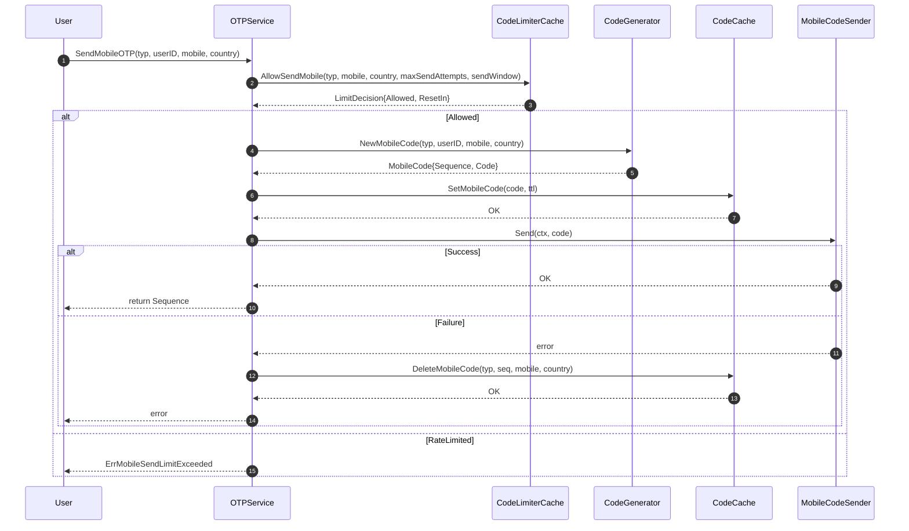
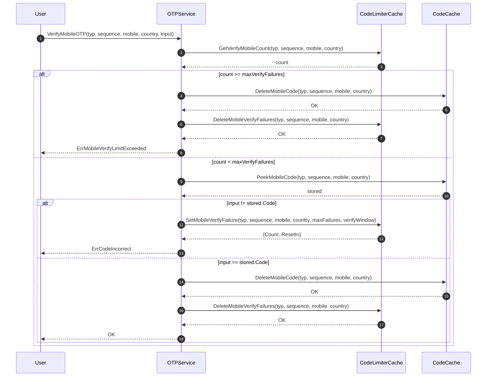

# Verification Package

A Go package for handling OTP (One-Time Password) verification codes, supporting mobile SMS, email, and ECDSA signature verification.

## Features

- Multi-channel support: mobile SMS, email, ECDSA signature
- Rate limiting for sending and verification attempts
- Redis-based atomic operations and cache
- Configurable code length, TTL, and limits

## Installation

```bash
go get github.com/crypto-zero/go-biz/verification
```

## Quick Start

### 1. Initialize Service

```go
import (
    "github.com/crypto-zero/go-biz/verification"
    "github.com/redis/go-redis/v9"
    "time"
)

// You need to implement or use existing CodeCache, CodeLimiterCache, MobileCodeSender, CodeGenerator
var cache verification.CodeCache
var limiterCache verification.CodeLimiterCache
var sender verification.MobileCodeSender
var generator verification.CodeGenerator

otpService := verification.NewOTPService(
    cache,
    limiterCache,
    sender,
    generator,
    time.Hour,         // sendWindowDuration
    10*time.Minute,    // verifyWindowDuration
    5*time.Minute,     // ttl
    3,                 // maxSendAttempts
    3,                 // maxVerifyFailures
)
```

### 2. Send Verification Code

```go
sequence, err := otpService.SendMobileOTP(
    ctx,
    "LOGIN",
    12345,           // userID
    "13800138000",
    "86",
)
if err != nil {
    // Handle errors
}
```
#### Sequence Diagram


### 3. Verify Code

```go
err := otpService.VerifyMobileOTP(
    ctx,
    verification.CodeTypeRegister,
    sequence,
    "13800138000",
    "86",
    "123456",        // user input
)
if err != nil {
    // Handle errors
}
```

#### Sequence Diagram

## Configuration Options

| Option               | Default      | Description                       |
|----------------------|--------------|-----------------------------------|
| RedisClient          | Required     | Redis client instance             |
| TTL                  | 5 minutes    | Code validity period              |
| MobileCodeLength     | 6            | Mobile code length                |
| EmailCodeLength      | 6            | Email code length                 |
| EcdsaCodeLength      | 32           | ECDSA signature length            |
| MaxVerifyFailures    | 3            | Max verification failures         |
| VerifyWindowDuration | 10 minutes   | Verification failure count window |

## Error Handling

| Error                              | Description                       |
|------------------------------------|-----------------------------------|
| ErrMobileSendLimitExceeded         | Send rate limit exceeded          |
| ErrEmailSendLimitExceeded          | Email send limit exceeded         |
| ErrMobileVerifyLimitExceeded       | Verification failure limit        |
| ErrEmailVerifyLimitExceeded        | Email verification failure limit  |
| ErrCodeIncorrect                   | Incorrect code                    |
| ErrCodeNotFound                    | Code not found or expired         |

## SMS/Email Integration

Implement the sender interface or use the built-in Aliyun SMS integration:

```go
import (
    "github.com/crypto-zero/go-biz/verification"
    "github.com/crypto-zero/go-biz/verification/aliyun"
    dysms "github.com/alibabacloud-go/dysmsapi-20170525/v3/client"
    "context"
    "time"
)

// 1. Create Alibaba Cloud Dysms client (refer to Alibaba Cloud SDK docs)
client := dysms.NewClient(&openapi.Config{
    // Fill in your Alibaba Cloud credentials and endpoint
})

// 2. Prepare template map
templateMap := map[verification.CodeType]*aliyun.Template{
    verification.CodeTypeRegister: {
        Code:        "your-template-code",
        SignName:    "your-sign-name",
        ParamsFormat: `{"code":"%s"}`,
    },
    // Add more types as needed
}

// 3. Create Aliyun SMS sender
smsSender := aliyun.NewSMS(client, templateMap)

// 4. Prepare other dependencies (implement these interfaces as needed)
var cache verification.CodeCache
var limiterCache verification.CodeLimiterCache
var generator verification.CodeGenerator

// 5. Create OTP service
otpService := verification.NewOTPService(
    cache,
    limiterCache,
    smsSender,
    generator,
    time.Hour,         // sendWindowDuration
    10*time.Minute,    // verifyWindowDuration
    5*time.Minute,     // ttl
    3,                 // maxSendAttempts
    3,                 // maxVerifyFailures
)
```

## Best Practices

- Set reasonable TTL for codes (5-10 minutes recommended)
- Configure send rate limits to prevent abuse
- Limit verification attempts to prevent brute force
- Log all critical operations
- Monitor abnormal metrics

## License

MIT

## Contributing

Issues and Pull Requests are welcome!
