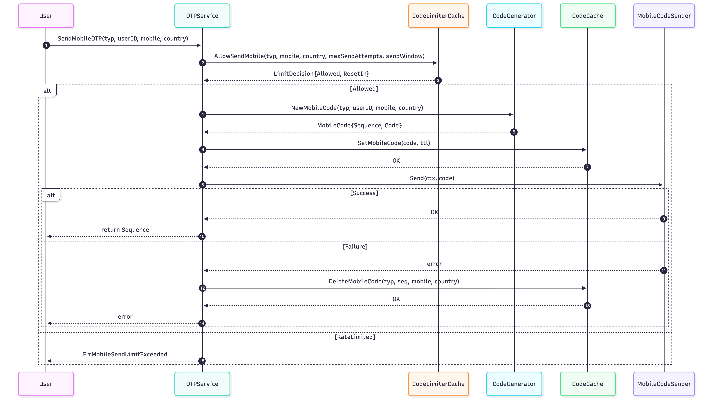
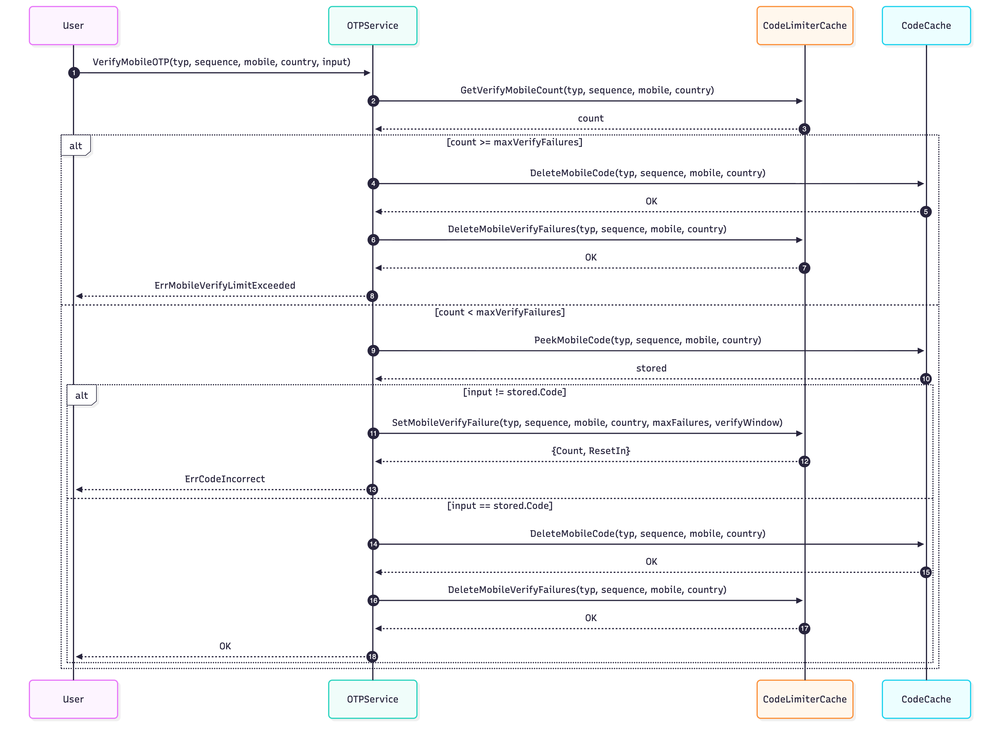

# Verification Package

A Go package for handling OTP (One-Time Password) verification codes, supporting mobile SMS, email, and ECDSA signature verification.

## Features

- Multi-channel support: mobile SMS, email, ECDSA signature
- Rate limiting for sending and verification attempts
- Redis-based atomic operations and cache
- Configurable code length, TTL, and limits

## Installation

```bash
go get github.com/Paratrix-xyz/go-biz/verification
```

## Quick Start

### 1. Initialize Service

```go
import (
    "github.com/Paratrix-xyz/go-biz/verification"
    "github.com/redis/go-redis/v9"
    "time"
)

redisClient := redis.NewClient(&redis.Options{
    Addr: "localhost:6379",
})

otpService := verification.NewOTPService(
    verification.WithRedisClient(redisClient),
    verification.WithTTL(5 * time.Minute),
    verification.WithMobileCodeLength(6),
    verification.WithMaxVerifyFailures(3),
    verification.WithVerifyWindowDuration(10 * time.Minute),
)
```

### 2. Send Verification Code

```go
sequence, err := otpService.SendMobileOTP(
    ctx,
    verification.CodeTypeRegister,
    "13800138000",
    "86",
    3,
    time.Hour,
)
if err != nil {
    // Handle errors
}
```

#### Sequence Diagram



### 3. Verify Code

```go
err := otpService.VerifyMobileOTP(
    ctx,
    verification.CodeTypeRegister,
    sequence,
    "13800138000",
    "86",
    "123456",
)
if err != nil {
    // Handle errors
}
```

#### Sequence Diagram



## Configuration Options

| Option                      | Default      | Description                       |
|-----------------------------|--------------|-----------------------------------|
| WithRedisClient             | Required     | Redis client instance             |
| WithTTL                     | 5 minutes    | Code validity period              |
| WithMobileCodeLength        | 6            | Mobile code length                |
| WithEmailCodeLength         | 6            | Email code length                 |
| WithEcdsaCodeLength         | 32           | ECDSA signature length            |
| WithMaxVerifyFailures       | 3            | Max verification failures         |
| WithVerifyWindowDuration    | 10 minutes   | Verification failure count window |

## Error Handling

| Error                              | Description                       |
|------------------------------------|-----------------------------------|
| ErrMobileSendLimitExceeded         | Send rate limit exceeded          |
| ErrEmailSendLimitExceeded          | Email send limit exceeded         |
| ErrMobileVerifyLimitExceeded       | Verification failure limit        |
| ErrEmailVerifyLimitExceeded        | Email verification failure limit  |
| ErrCodeIncorrect                   | Incorrect code                    |
| ErrCodeNotFound                    | Code not found or expired         |

## SMS/Email Integration

Implement the sender interface or use the built-in Aliyun SMS integration:

```go
import "github.com/Paratrix-xyz/go-biz/verification/aliyun"

sender := aliyun.NewSMSSender(
    "your-access-key-id",
    "your-access-key-secret",
    "your-sign-name",
    "your-template-code",
)

otpService := verification.NewOTPService(
    verification.WithRedisClient(redisClient),
    verification.WithSMSSender(sender),
)
```

## Redis Key Naming

- Code storage: `otp:{type}:{sequence}:mobile:{mobile}:{country_code}`
- Rate limiting: `limit:send:mobile:{type}:{mobile}:{country_code}`
- Verification failures: `limit:verify:mobile:{type}:{sequence}:{mobile}:{country_code}`

## Best Practices

- Set reasonable TTL for codes (5-10 minutes recommended)
- Configure send rate limits to prevent abuse
- Limit verification attempts to prevent brute force
- Log all critical operations
- Monitor abnormal metrics

## License

MIT

## Contributing

Issues and Pull Requests are welcome!
