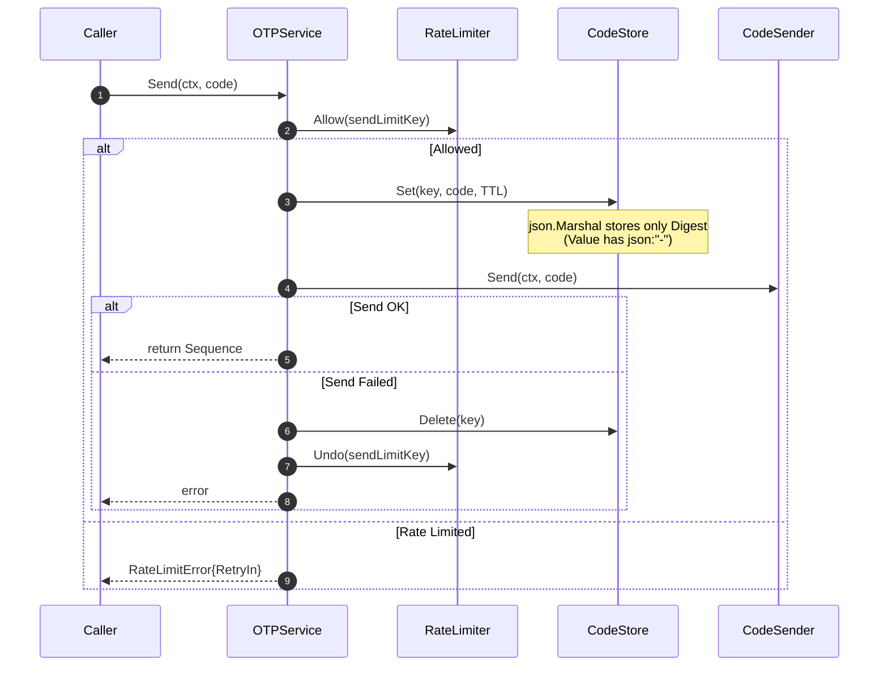
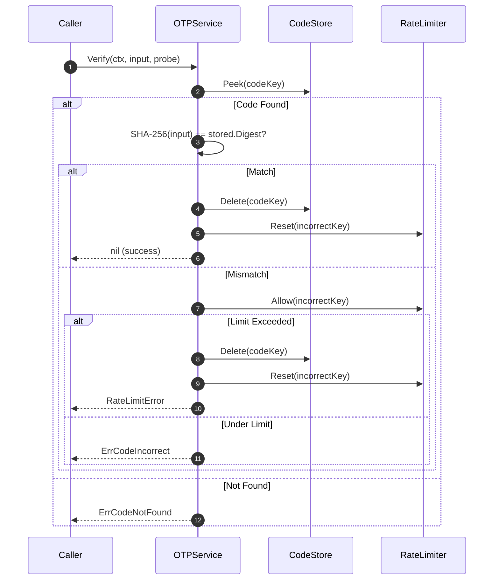

# Verification Package

A type-safe, generic OTP (One-Time Password) verification package for Go,
supporting mobile SMS, email, and ECDSA signature verification channels.

## Features

- **Generic `OTPService[T]`** — one service per channel, fully type-safe
- **SHA-256 hashed storage** — plaintext codes (`Value`) are never persisted; only the `Digest` is stored in Redis
- **Rate limiting** — configurable send and verify limits with automatic cleanup
- **Redis-backed** — atomic operations via Lua scripts for concurrency safety
- **Pluggable senders** — implement `CodeSender[T]` for any delivery backend

## Installation

```bash
go get github.com/crypto-zero/go-biz/verification
```

## Quick Start

### 1. Create a Code Generator

```go
gen := verification.NewCodeGenerator(6) // 6-digit codes
```

### 2. Configure and Create a Service

```go
cfg := verification.DefaultOTPConfig("MY_APP")

// Customize if needed
cfg.TTL = 5 * time.Minute
cfg.Send = verification.RateLimiterConfig{
    Limit: 3, Window: time.Minute,
    LimitErr: verification.ErrMobileSendLimitExceeded,
}
cfg.Verify = verification.RateLimiterConfig{
    Limit: 5, Window: 5 * time.Minute,
    LimitErr: verification.ErrMobileVerifyLimitExceeded,
}

svc := verification.NewOTPService[verification.MobileCode](cfg, redisClient, smsSender)
```

### 3. Send a Verification Code

```go
mc, _ := gen.NewMobileCode("LOGIN", userID, "13800138000", "86")
seq, err := svc.Send(ctx, mc)
// seq is the unique sequence ID for later verification
```

### 4. Verify

```go
probe := &verification.MobileCode{
    Code:        verification.Code{Type: "LOGIN", Sequence: seq},
    Mobile:      "13800138000",
    CountryCode: "86",
}
err := svc.Verify(ctx, userInput, probe)
```

## Architecture

### Send Flow


```mermaid
sequenceDiagram
    autonumber
    participant Caller
    participant OTPService
    participant RateLimiter
    participant CodeStore
    participant CodeSender

    Caller->>OTPService: Send(ctx, code)
    OTPService->>RateLimiter: Allow(sendLimitKey)
    alt Allowed
        OTPService->>CodeStore: Set(key, code, TTL)
        Note over CodeStore: json.Marshal stores only Digest<br/>(Value has json:"-")
        OTPService->>CodeSender: Send(ctx, code)
        alt Send OK
            OTPService-->>Caller: return Sequence
        else Send Failed
            OTPService->>CodeStore: Delete(key)
            OTPService->>RateLimiter: Undo(sendLimitKey)
            OTPService-->>Caller: error
        end
    else Rate Limited
        OTPService-->>Caller: RateLimitError{RetryIn}
    end
```

### Verify Flow


```mermaid
sequenceDiagram
    autonumber
    participant Caller
    participant OTPService
    participant CodeStore
    participant RateLimiter

    Caller->>OTPService: Verify(ctx, input, probe)
    OTPService->>CodeStore: Peek(codeKey)
    alt Code Found
        OTPService->>OTPService: SHA-256(input) == stored.Digest?
        alt Match
            OTPService->>CodeStore: Delete(codeKey)
            OTPService->>RateLimiter: Reset(incorrectKey)
            OTPService-->>Caller: nil (success)
        else Mismatch
            OTPService->>RateLimiter: Allow(incorrectKey)
            alt Limit Exceeded
                OTPService->>CodeStore: Delete(codeKey)
                OTPService->>RateLimiter: Reset(incorrectKey)
                OTPService-->>Caller: RateLimitError
            else Under Limit
                OTPService-->>Caller: ErrCodeIncorrect
            end
        end
    else Not Found
        OTPService-->>Caller: ErrCodeNotFound
    end
```

## Security Model

| Concern | Solution |
|---|---|
| Plaintext exposure in Redis | `Value` field has `json:"-"`; only `Digest` (SHA-256) is persisted |
| Timing attacks | Constant-time comparison (`crypto/subtle`) for digest matching |
| Brute force | Configurable verify rate limiter with automatic code deletion on limit |
| Send abuse | Configurable send rate limiter with rollback on delivery failure |
| Concurrent double-use | Atomic `Delete` check — second consumer sees `deleted=false` |

## Configuration

```go
type OTPConfig struct {
    Prefix CodeCacheKeyPrefix // Redis key prefix
    TTL    time.Duration      // Code expiration
    Send   RateLimiterConfig  // Send rate-limit policy
    Verify RateLimiterConfig  // Verify rate-limit policy
}

type RateLimiterConfig struct {
    Limit    int64         // Max attempts within Window
    Window   time.Duration // Sliding window duration
    LimitErr error         // Error returned when limit is exceeded
}
```

`DefaultOTPConfig(prefix)` provides secure defaults:
- TTL: 5 minutes
- Send: 1 per minute
- Verify: 5 attempts per 5 minutes

## Error Handling

| Error | Description |
|---|---|
| `ErrCodeNotFound` | Code expired or never sent |
| `ErrCodeIncorrect` | Wrong code (under limit) |
| `*RateLimitError` | Rate limit exceeded (wraps `LimitErr`, includes `RetryIn`) |
| `ErrSendFailed` | Delivery backend error |

## Sender Integration

Implement `CodeSender[T]` for your delivery backend:

```go
type CodeSender[T VerificationCode] interface {
    Send(ctx context.Context, code *T) error
}
```

Built-in senders:
- `verification/aliyun` — Alibaba Cloud Dysms SMS
- `verification/smtp` — Standard SMTP email

## License

MIT
